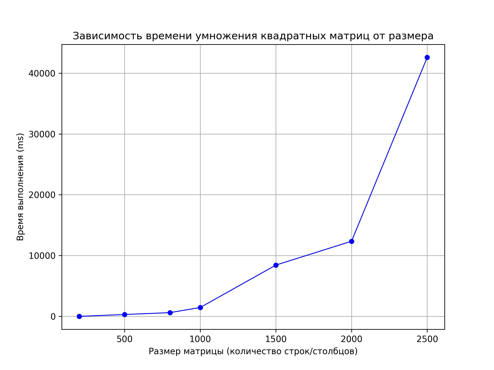
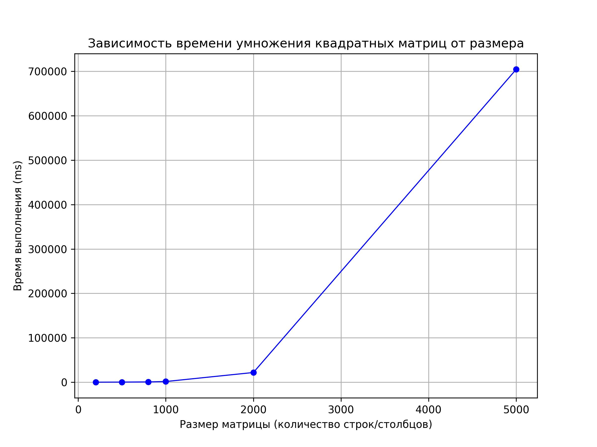

# Отчёт по лабораторной работе № 1

**Выполнил:**
Студент группы **6212-100503D**
ФИ **Должиков Дмитрий**

---

## Задание

Написать программу на языке C/C++ для перемножения двух квадратных матриц.
Исходные данные: файл(ы) содержащие значения исходных матриц.
Выходные данные: файл со значениями результирующей матрицы, время выполнения, объем задачи.
Обязательна автоматизированная верификация результатов вычислений с помощью сторонних библиотек или стороннего ПО (например на Matlab/Python).

---

## Ход работы

Было написано 2 класса: **Matrix** и **stats**. Первый реализует матрицы, работу с ними и в том числе умножение. Второй – нужен для удобного хранения статистики по времени и объему работы, а также проверки корректности результата. В основной функции программы (main) реализуется загрузка матриц в память, выполнение умножения с подсчетом затраченного времени, а также автоматическая проверка корректности результата с помощью **python numpy**. Программа может выполнять несколько умножений подряд без перезапуска и выводить результаты в файл. Для работы программе необходим файл `input.txt` с матрицами, находящийся в одной директории с исполняемым файлом в формате: размерность матрицы, 2 матрицы разделенные пустой строкой.

В результате нескольких запусков все результаты прошли проверку на корректность и были установлены следующие зависимости:

---

## Вывод

В ходе работ я написал программу на языке C/C++ для перемножения двух квадратных матриц и установил зависимость времени умножения от количества данных.

---
