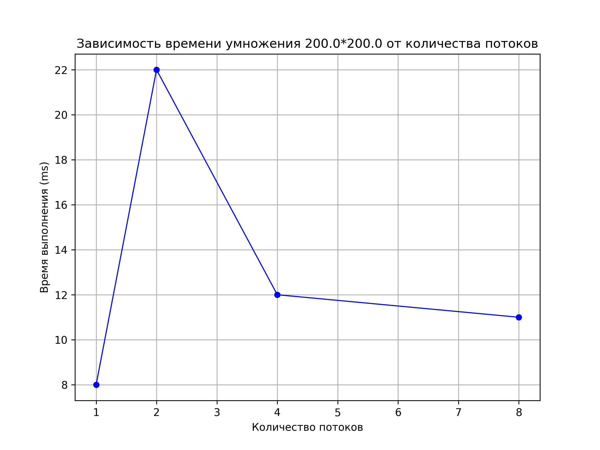
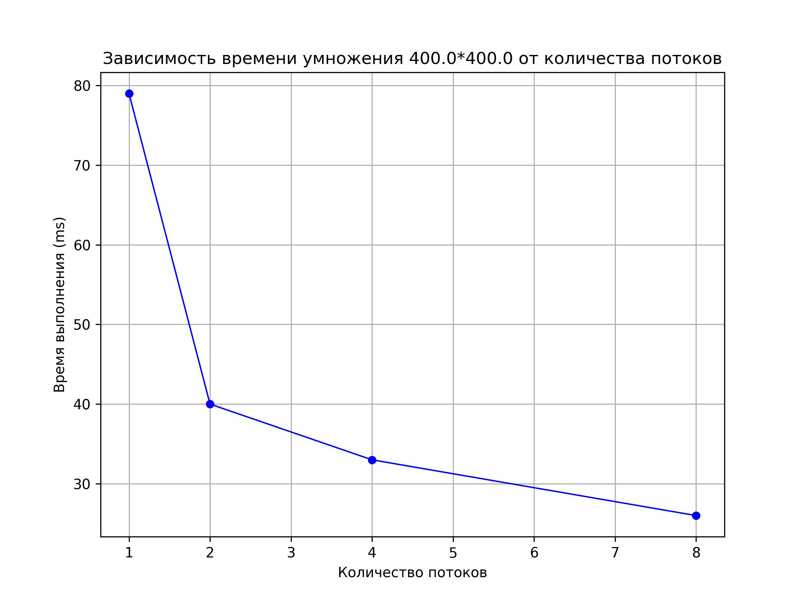
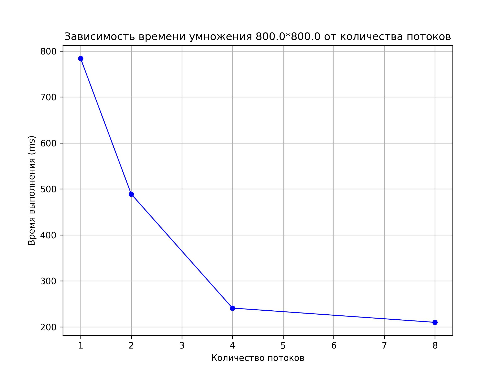
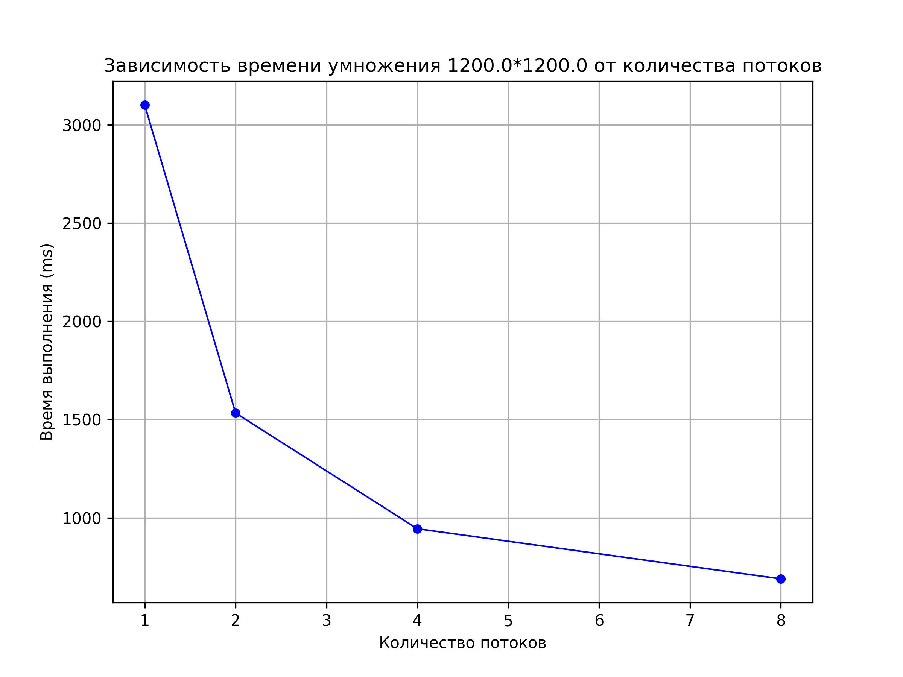
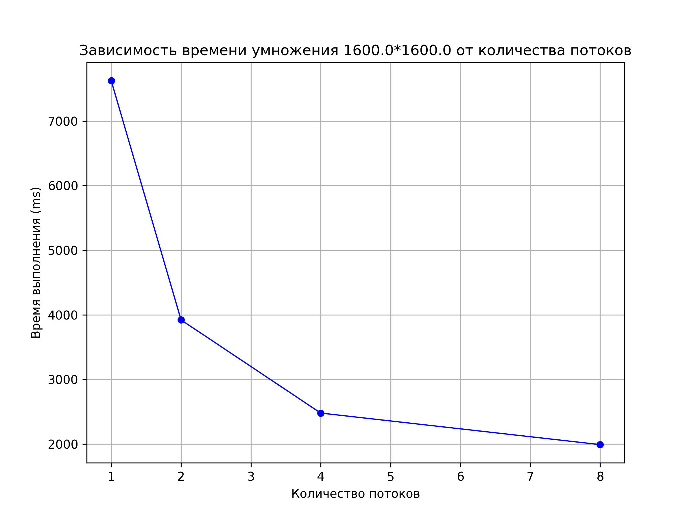
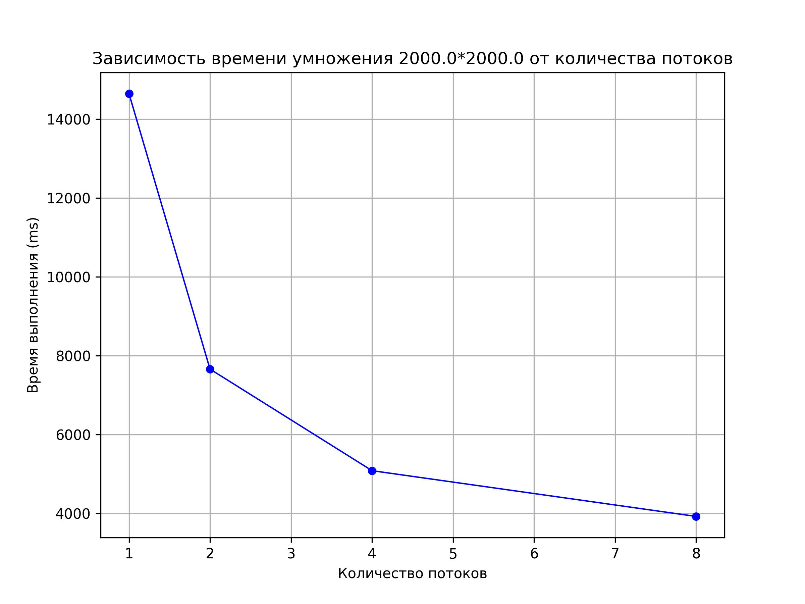

# Отчёт по лабораторной работе № 2

**Выполнил:**
Студент группы **6212-100503D**
ФИ **Должиков Дмитрий**

---

## Задание

Модифицировать программу из л/р №1 для параллельной работы по технологии OpenMP. Провести серию экспериментов с разным количеством потоков (1, 2, 4, 8 и т.д.), разными размерами матриц (примерно 200, 400, 800, 1200, 1600, 2000), с разным количеством вычислительных ядер (1, 2, 4, 8 и т.д.).

---

## Ход работы

Была модифицирована часть уможения матриц по технологии OpenMP. Была добалена часть для проведения исследования с разным количеством потоков. Результаты исследования можно найти в `results/output.txt` и `results/to_plot.txt` по которому были построены графики:

**БОЛЕЕ ТОЧНЫЕ ДАННЫЕ В ФАЙЛАХ**

---

## Вывод

В ходе работ я модифицировал программу из л/р №1 для параллельной работы по технологии OpenMP. Провел серию экспериментов с разным количеством потоков, разными размерами матриц, с разным количеством вычислительных ядер.

---
