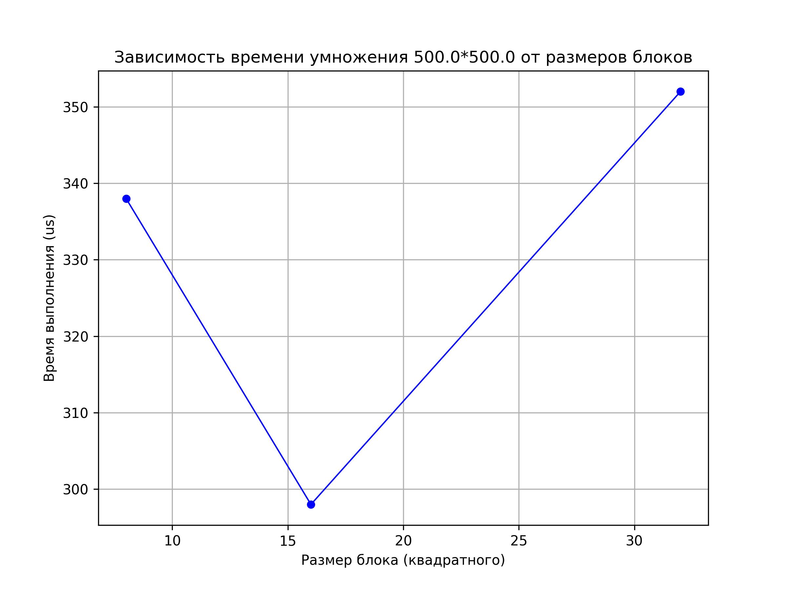
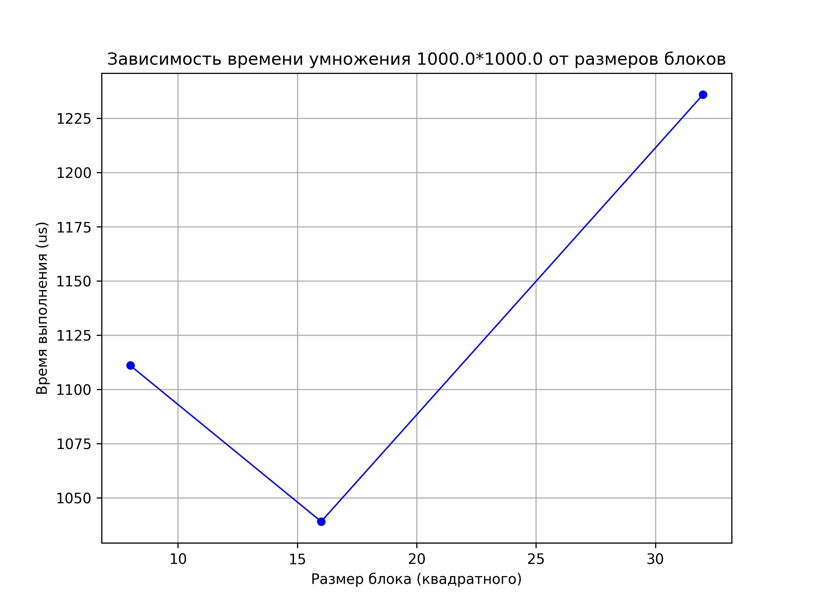
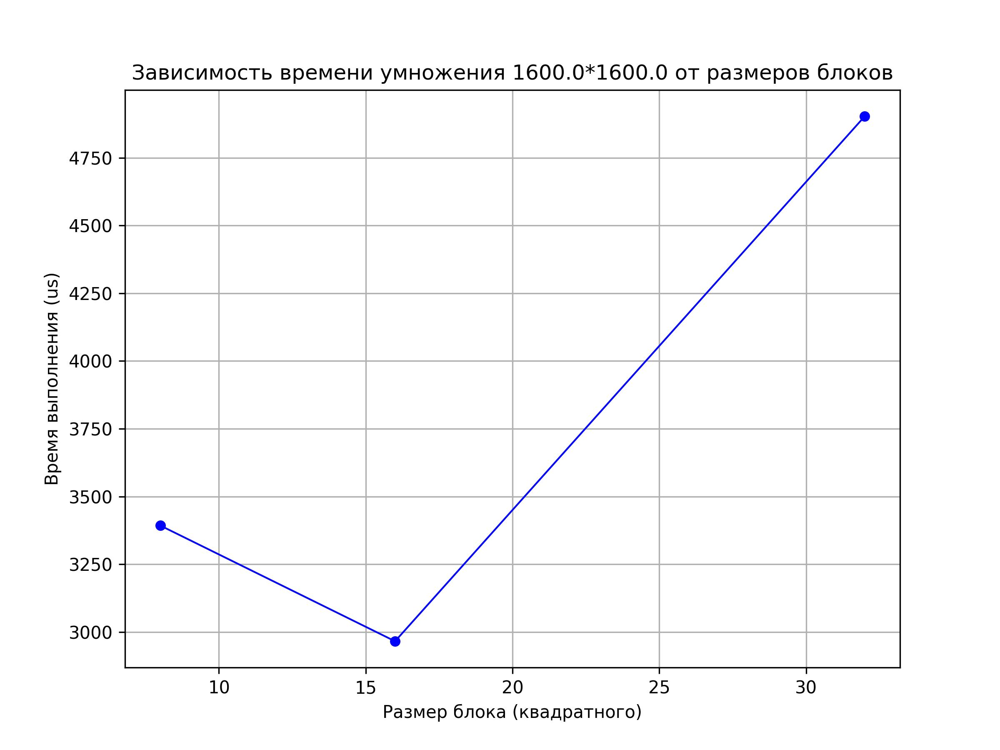
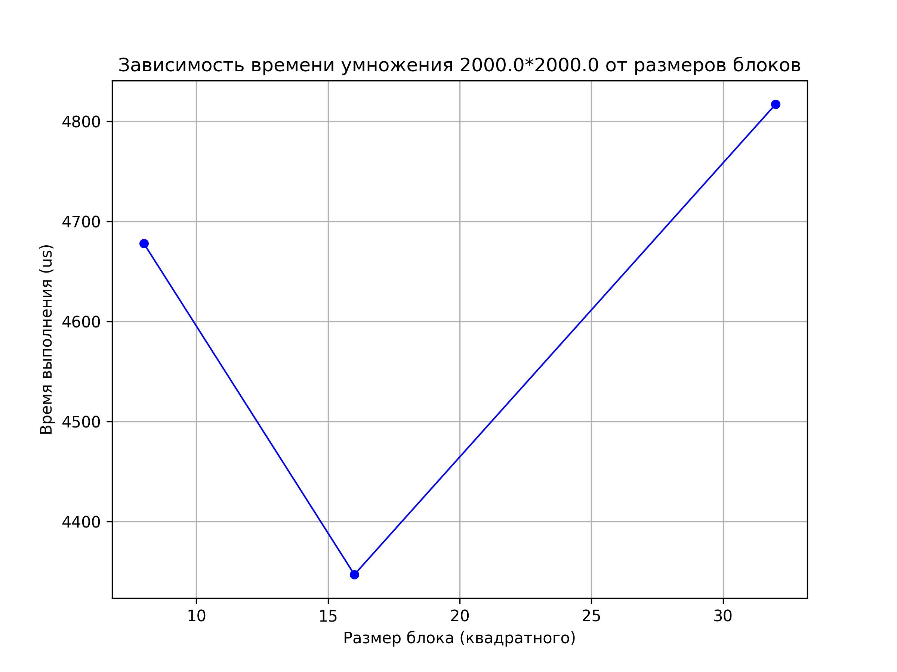
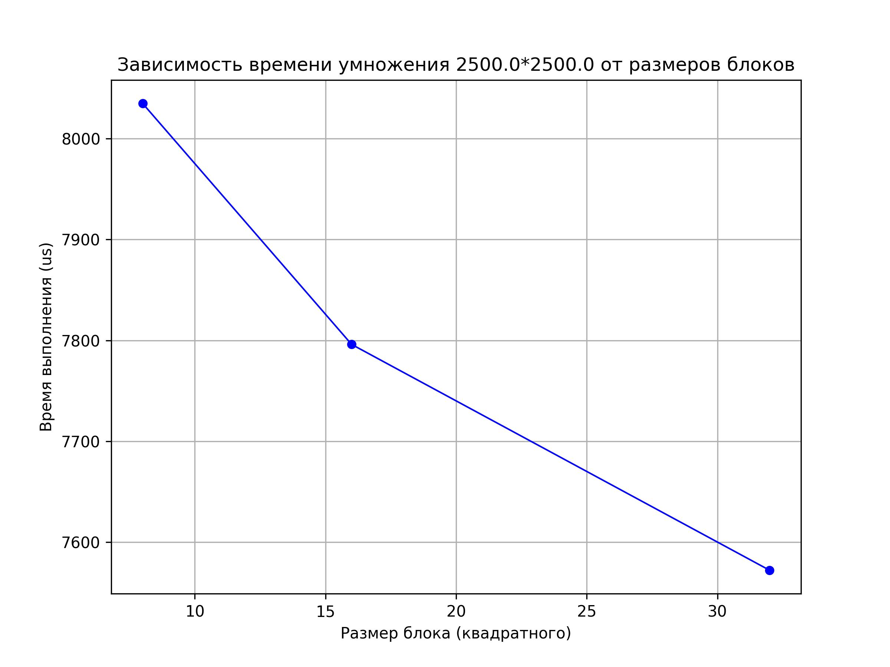

# Отчёт по лабораторной работе № 4

**Выполнил:**
Студент группы **6212-100503D**
ФИ **Должиков Дмитрий**

---

## Задание

Модифицировать программу из л/р №1 для параллельной работы по технологии CUDA. Провести эксперименты с разными размерами матриц и различными конфигурациями сетки блоков.

---

## Ход работы

Была модифицирована программа из л/р №1 для параллельной работы по технологии CUDA. Были проведены исследования на блоках 8х8 16х16 32х32. Также, для каждого размера матриц дополнительно был проведен тест с разделенной памятью (графики в `/results/plot*(shared).jpg`). Скомпилированная версия прораммы `results/lab4.exe` для вычислений использовала видеокарту **NVIDIA GeForce GTX 1050TI 4Gb** Результаты исследования можно найти в `results/output.txt` и `results/to_plot.txt` по которому были построены графики:

**БОЛЕЕ ТОЧНЫЕ ДАННЫЕ В ФАЙЛЕ `results/output.txt`**

---

## Вывод

В ходе работ я модифицировал программу из л/р №1 для параллельной работы по технологии CUDA. Провел эксперименты с разными размерами матриц (500, 800, 1000, 1600, 2000, 2500) и различными конфигурациями сетки блоков.

---
